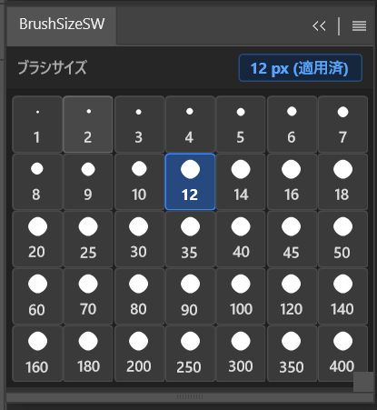

# BrushSizeSW (Brush Size Switcher)

Photoshop上で、**ブラシ**および**消しゴム**のサイズをワンクリックで瞬時に切り替えることができるUXPパネルプラグインです。  
ペイント作業やレタッチ、マスキング作業中のブラシサイズ調整の手間を大幅に軽減します。

---

<p align="center">
  
</p>

---

## 概要・特徴

- **ワンクリックで瞬時にサイズ変更**  
  スライダーを動かしたりショートカットキーを連打することなく、目的のサイズボタンを押すだけで即座に反映されます。
- **35段階の細かなプリセット**  
  イラストやレタッチで頻用される細いペン先から広範囲の塗り・消去まで幅広くカバー：  
  `1, 2, 3, 4, 5, 6, 7, 8, 9, 10, 12, 14, 16, 18, 20, 25, 30, 35, 40, 45, 50, 60, 70, 80, 90, 100, 120, 140, 160, 180, 200, 250, 300, 350, 400 (px)`
- **ブラシ＆消しゴムの両対応**  
  現在選択中のツールを自動判定し、ブラシ（`paintbrushTool`）または消しゴム（`eraserTool`）のサイズを変更します。他のツール選択中には誤動作しない安全設計です。
- **直感的なドットプレビュー＆アクティブ表示**  
  ボタン内に実際のサイズ感をイメージできる円形プレビュー（小サイズは個別比率、大サイズはインジケーター）を配置。現在適用中のサイズはハイライトされます。
- **Photoshopネイティブに馴染むダークUI**  
  Photoshopのインターフェーステーマに合わせたフラット＆ダークなデザインで、ワークスペースに自然に溶け込みます。
- **UXP Modal Execution対応**  
  最新のUXP API（`executeAsModal` / `batchPlay`）を使用しており、エラーやキャンバス未オープン時も分かりやすいガイダンスを表示します。

---

## 動作要件

- **対象アプリケーション**: Adobe Photoshop 2022 (v23.0.0) 以降
- **動作確認バージョン**: Adobe Photoshop 2026 (v27.9.1)
- **対応OS**: Windows 10/11 (macOSは未検証)

---

## インストール・導入方法

本プラグインは、構成ファイルをZIP圧縮し、拡張子を `.ccx` に変更することで簡単にPhotoshopへインストールできます。

### 手順

1. **構成ファイルをZIP圧縮する**  
   本フォルダ内の以下のファイルを選択し、ZIP形式で圧縮します。
   - `manifest.json`
   - `index.html`
   - `index.js`

   > **注意**  
   > フォルダごと圧縮するのではなく、必ず**ファイル群を直接選択してZIP圧縮**してください（ZIPを展開した直下の階層に `manifest.json` が存在する状態にします）。

2. **拡張子を `.ccx` にリネームする**  
   作成された `.zip` ファイルの名前を変更し、拡張子を `.ccx` にします。  
   （例：`BrushSizeSW.zip` → `BrushSizeSW.ccx`）

   > ※ 拡張子が表示されていない場合は、Windowsのエクスプローラー（またはMacのFinder）の設定で「ファイル名拡張子」を表示するようにしてください。

3. **ダブルクリックしてインストールする**  
   作成した `.ccx` ファイルをダブルクリックします。  
   Adobe Creative Cloud デスクトップが自動的に立ち上がり、Photoshopへのインストールが完了します。

---

## 使い方

1. Photoshopを起動し、任意の画像または新規ドキュメントを開きます。
2. メニューバーの `プラグイン` ＞ `BrushSizeSW` ＞ `BrushSizeSW` から本パネルを表示します。  
   _(ドックや好みのパネル位置にドラッグ＆ドロップして配置できます)_
3. ツールバーで **ブラシツール** または **消しゴムツール** を選択します。
4. パネル上の希望のサイズボタンをクリックします。
5. 上部のヘッダーに `〇〇 px (適用済)` と表示され、ツールの直径が即座に切り替わります。

> **ヒント**  
> ドキュメントが開かれていない場合や、ブラシ・消しゴム以外のツール（移動ツールや選択ツールなど）を選択している場合はサイズ変更がスキップされます。

---

## ファイル構成

```text
Brush Size Switcher/
├── manifest.json   # プラグインの定義ファイル（UXP Manifest v4）
├── index.html      # パネルUI構造・スタイリング（ダークテーマ）
├── index.js        # ブラシ/消しゴム判定およびbatchPlayによるサイズ適用ロジック
└── README.md       # 本ドキュメント
```

---

## カスタマイズ

パネルに表示するブラシサイズを変更・追加したい場合は、[index.html](file:///index.html) の `<div class="grid-container">` 内にあるボタン定義（`data-size="数値"`）を自由に編集してください。

```html
<!-- 例：500pxのボタンを追加する場合 -->
<div class="btn" data-size="500">
  <div class="circle-wrap"><span class="circle s-big"></span></div>
  <span class="label">500</span>
</div>
```

---

## ライセンス

本プロジェクトは [MIT License](LICENSE) のもとで公開されています。（用途に合わせて適宜変更してください）
